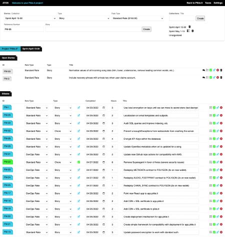

💬&nbsp;&nbsp;&nbsp;[Tweet About ATOS](http://twitter.com/intent/tweet?text=Freelancers!+Check+out+ATO+Stories+%2C+a+drop+dead+simple%2C+locally+hosted+story+tracker+and+invoice+generator+designed+for+freelancer+software+developers.&url=https%3A%2F%2Fgithub.com%2Fjbelelieu%2Fato_stories)&nbsp;&nbsp;&nbsp;☕️&nbsp;&nbsp;&nbsp;[Buy me a Coffee!](https://www.buymeacoffee.com/jbelelieu)

ATOS is built by a freelancer, for freelancers.

ATOS is a locally hosted, no setup-required, application that makes invoicing against backlogs drop dead simple. ATOS is designed to:

- **Project Management**: Track stories
- **Invoice Generation**: Generate invoices against those completed stories

ATOS is 100% open source and free to use.



# Notice About Deploying ATOS To The Web

This was always meant to be used locally. While there shouldn't be any problems deploying it, I don't recommend allowing anyone to access this who you don't fully trust. There is no concept of "users" in the platform, so anyone with access will be able to do whatever they want with your data.

-----

# Requirements

- PHP8+
- SQLite3

# Local Setup

## Update Your Default Settings (Optional Step)

Open `SystemSettings.sample.php` and update the values as needed. Optionally rename it to `SystemSettings.env.php`, otherwise ATOS will do that for you.

## Start the PHP Server

Once in the home directory of your project, via command line, state the PHP server:

```
php -S localhost:9001
```

You can now access ATOS from any web browser at `http://localhost:9001`.

## phpLiteAdmin Notice

For your convinience, ATOS ships with [phpLiteAdmin](https://www.phpliteadmin.org/). You can access that from `http://localhost:9001/db`.

ATOS will automatically attempt to run migrations at first start up. On the off chance that migrations fail, you can use phpLiteAdmin to manually execute the contents of `db/migrations.sql`.

## Invoices

If you plan on generating and saving invoices locally (which I recommend you do), you will need to make sure the `invoices` directory is writable: `chmod 0755 invoices`.

Note that invoices are saved as HTML. Most computers have reasonable "Print as PDF" options now; please use that feature to print a PDF if required. Note that ATOS hard codes styles, so changing `assets/style.css` won't affect already saved invoices.

-----

# Features

- **Drop Dead Simple**: The point of this is to be easy to use, drop dead simple, and efficient. You shouldn't be fighting with project management tools; focus on coding.
- **All Your Projects In One Spot**: Manage as many projects as you wish, each with their own collections, stories, etc..
- **Bill Different Projects As Different Entities**: Set up multiple company profiles, for yourself and your clients. Each project is assigned a contracted party, as well as the client company, allowing you flexiblity to offer services as different entities.
- **Invoicable Story Collections**: Create a collection of stories descrbing one billable period, and automatically generate detailed invoices breaking down your work, the rates for each service, and more.
- **Beautiful Invoices**: Generate beautiful, dynamic, and customizable invoices with one click of the mouse! Everything is template based, allowing you easy access to edit the look and feel of the templates you generate.
- **Story Types**: The application allows you to create as many story types as you wish. Defaults are the standard `Story` and `Chore` types.
- **Rate Types**: Each story can be assigned it's own billable rate. This means that you can offer different hourly rates for different types of services, such as standard coding vs devops rates.
- **Flexible Stories**: Use the story tool to manage your entire project, or copy and paste story IDs and titles directly from your client's JIRA (for example) and use ATOS to track and bill hours against known stories.

-----

# Tips and Tricks

#### Example Use Case

Mine! I built this because I was juggling multiple contract projects at once and needed to keep track of what I was working on, billing, etc.. This pseudo-PM tool with built in invoice generation allows me to manage all projects for multiple clients all at once, without needing a bunch of different software.

#### Mobile Experience

This was never meant to be used on mobile. I highly recommend using this on a desktop over mobile.

-----

# FAQ

#### What stories get places on invoices?

All stories set to a "Closed" state. If you don't want something appearing on an invoice, either bump it back to the default collection or into an "Open" state

-----

# Roadmap Features

Note that I only work on this when I have time, which isn't very often. So while ideally I'd like to get these out sooner than later, I can't make guarantees on when I'll get to them.

- Search features for projects: By type, by rate, by title, by ID, by completed date.
- Estimated tax tools: for American freelancers, guidance and help on how to estimate your quarterly taxes.

-----

# Additional Resources for Freelancers

- Estimated Taxes Spreadsheet: 

-----

# Special Thank You

- The fine folks over at [phpLiteAdmin](https://www.phpliteadmin.org/) for the SQLite3 manager.
- The artists over at [flaticon](https://flaticon.com/) for their CSS icon set.